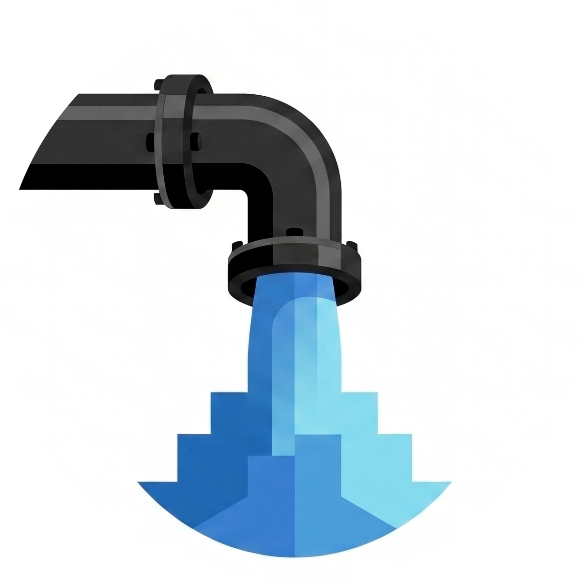
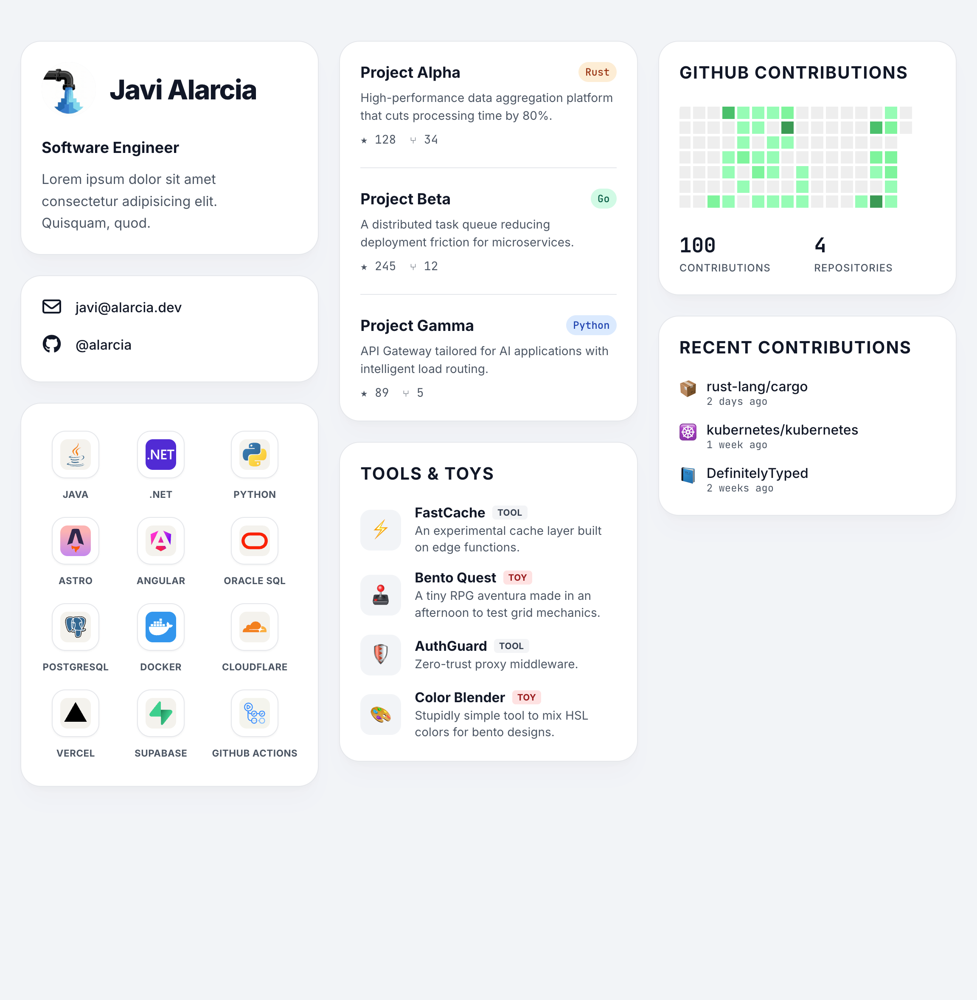

  
  # <a href="https://alarcia.dev"> alarcia.dev</a>

  **High-Performance, Data-Driven, Minimalist Bento Portfolio**

  

   
    
    
  

---

## Features

- 🍱 **Bento Grid Architecture**: A modular, highly visual interface that organizes complex information into clean, digestible blocks.
- ⚡ **Astro-Powered Performance**: Static-first generation with near-zero client-side JavaScript for instant load times.
- 🐙 **Automated GitHub Statistics**: Direct integration with the GitHub API to display real-time contribution metrics and repository data.
- 🟢 **Dynamic Status Card**: Live status text and tags sourced from GitHub Gist, with local JSON fallback for resilient rendering.
- 🕒 **Recent Activity Feed**: Activity card focused on the latest commits and repositories, automatically refreshed from public GitHub events.
- 📄 **Built-In CV Access**: Dedicated contact entry linking directly to your CV for immediate recruiter-friendly navigation.
- 🎨 **Native Tech Stack Icons**: Vibrant, official iconography provided by Devicon and FontAwesome without the overhead of custom asset management.
- 🧩 **Refined Project Cards**: Projects and Tools & Toys cards now ship with dedicated layouts including visual tags, type badges, and direct external links.
- 🌍 **Privacy-First Design**: Zero-cookie implementation that respects user data and simplifies global compliance.
- 📦 **JSON-Powered Content**: Fully decoupled data architecture. All personal data, projects, and tech stacks are managed via `site.json`, `projects.json`, and `techstack.json`.

---

## Build your own

Built with a data-driven architecture, this repository functions as a ready-to-use template for any developer. Deployment is achievable in minutes by editing a single configuration file.

1. **Fork this repository** to a personal GitHub account.
2. **Configure Data Files**: All essential content is managed through JSON files in `src/data/`:
   - `site.json`: Hero text, social links, SEO metadata, and card labels.
  - `site.json` also controls your CV entry (`contact.cv`, `contact.resume`) and live status system (`statusSource`, `status`).
   - `projects.json`: Comprehensive list of open-source projects or portfolio work.
  - `projects.json` also powers the `toolsAndToys` dataset and recent activity fallback entries.
   - `techstack.json`: Catalog of technologies and tools displayed in the stack section.
3. **Refine the aesthetic**: All card titles are optional. Removing strings from the `labels` object in `site.json` will hide headers automatically for an ultra-minimalist appearance.
4. **Deploy**: Compatible with all major static hosting platforms (Vercel, Netlify, Cloudflare Pages) with zero configuration.

Current card behavior is intentionally specialized: the Projects card highlights each project with stack tags and outbound links, while the Tools & Toys card focuses on lightweight experiments with explicit type badges (`tool` / `toy`) and compact quick-access links.

---

## Tech Stack

- **Framework:** [Astro 6](https://astro.build/)
- **Architecture:** Bento Grid (CSS Grid & Flexbox)
- **Icons & Assets:** [FontAwesome 6](https://fontawesome.com/), [Devicon](https://devicon.dev/)
- **Development:** [TypeScript](https://www.typescriptlang.org/)
- **Infrastructure:** [Docker](https://www.docker.com/) (Self-hosting optimized)

---

## Roadmap to Production

The following milestones are prioritized for the upcoming production release:

- **Localization**: Adding support to switch the interface to Spanish.
- **Dark Mode Toggle**: Implementing a user-facing switch for light and dark themes.
- **Containerization**: Finalizing `Dockerfile` and `docker-compose.yml` for self-hosted environments.
- **Domain Deployment**: Final DNS configuration and SSL certification for `alarcia.dev`.

---

  
Built with ❤️ by <a href="https://github.com/alarcia">alarcia</a>

